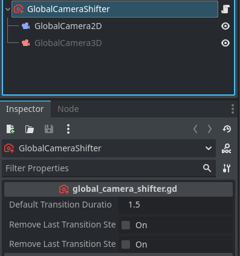

<div align="center">
	

<h3 align="center">Indie Blueprint Camera Transitioner</h3>

  <p align="center">
   This camera transition system allows you to smoothly transition between cameras in your 2D/3D game.
	<br />
	·
	<a href="https://github.com/ninetailsrabbit/indie-blueprint-camera-transitioner/issues/new?assignees=ninetailsrabbit&labels=%F0%9F%90%9B+bug&projects=&template=bug_report.md&title=">Report Bug</a>
	·
	<a href="https://github.com/ninetailsrabbit/indie-blueprint-camera-transitioner/issues/new?assignees=ninetailsrabbit&labels=%E2%AD%90+feature&projects=&template=feature_request.md&title=">Request Features</a>
  </p>
</div>

<br>
<br>

- [Installation 📦](#installation-)
- [Camera transitioner 🎥](#camera-transitioner-)
  - [Signals](#signals)
  - [How to use](#how-to-use)
  - [Transition steps](#transition-steps)

# Installation 📦

1. [Download Latest Release](https://github.com/ninetailsrabbit/indie-blueprint-camera-transitioner/releases/latest)
2. Unpack the `addons/indie-blueprint-camera-transitioner` folder into your `/addons` folder within the Godot project
3. Enable this addon within the Godot settings: `Project > Project Settings > Plugins`

To better understand what branch to choose from for which Godot version, please refer to this table:
|Godot Version|indie-blueprint-camera-transitioner Branch|indie-blueprint-camera-transitioner Version|
|---|---|--|
|[](https://godotengine.org/)|`4.3`|`1.x`|
|[](https://godotengine.org/)|`main`|`1.x`|

# Camera transitioner 🎥

This system allows you to smoothly transition between cameras in your game using the `GlobalCameraShifter` class. To enable this functionality, you'll need to autoload the `autoload/camera/global_camera_transition.tscn`. This scene creates two cameras internally for transition purposes.

**Concept:**
The system utilizes a third, global camera to facilitate the transition between two other cameras. This temporary camera mimics the properties of the camera you want to transition to. Once the transition completes, the target camera becomes the active camera in your scene.

**Benefits**:

- **Record Transitions:** Easily record transition sequences between cameras for smooth playback.
- **Manage Duration:** Control the duration of the transition for a polished effect.

**_Important note_**
If a camera transition is already in progress, attempting to trigger another transition of the same type _(2D or 3D)_ will not interrupt the ongoing one. Wait for the current transition to finish before initiating a new one.

This system can handle simultaneous transitions between cameras, but with a limitation: only one transition can be active at a time for each camera type _(2D or 3D)_.

In simpler terms, you can't have multiple transitions happening for the same type of camera _(2D or 3D)_ at once. However, you can transition between two 3D cameras while also transitioning between two separate 2D cameras in a Subviewport.

## Signals

```swift
transition_2d_started(from: Camera2D, to: Camera2D, duration: float)
transition_2d_finished(from: Camera2D, to: Camera2D, duration: float)
transition_3d_started(from: Camera3D, to: Camera3D, duration: float)
transition_3d_finished(from: Camera3D, to: Camera3D, duration: float)
```

## How to use

First of all you can configure few parameters on this autoload scene



- **Default transition duration:** The default duration to transition between cameras
- **Remove last transition step 2D/3D on back:** In a list of cameras to transition, going backwards, you can decide whether or not to remove the last one from this list in order not to transition back to it.

To transition to a target camera you can use this methods depending on whether it is 2D or 3D

```swift
func transition_to_requested_camera_2d(from: Camera2D, to: Camera2D, duration: float = default_transition_duration, record_transition: bool = true)

func transition_to_requested_camera_3d(from: Camera3D, to: Camera3D, duration: float = default_transition_duration, record_transition: bool = true)
```

## Transition steps

When a transition is recorded _(`record_transition == true`)_ it will create a class `TransitionStep2D` or `TransitionStep3D` depending on the transition requested.

```swift
class TransitionStep2D:
	var from: Camera2D
	var to: Camera2D
	var duration: float

	func _init(_from: Camera2D, _to: Camera2D, _duration: float)

class TransitionStep3D:
	var from: Camera3D
	var to: Camera3D
	var duration: float

	func _init(_from: Camera3D, _to: Camera3D, _duration: float)
```

```swift
// You can access the current recorded transitions through the variables:
var transition_steps_2d: Array[TransitionStep2D] = []
var transition_steps_3d: Array[TransitionStep3D] = []

//Transition to the provided camera from the last step recorded on transition_steps_2d. If there are no recorded steps, no transition occurs.
func transition_to_next_camera_2d(to: Camera2D, duration: float = transition_duration)

// Similar to the 2D version, but applies to 3D camera transitions.
func transition_to_next_camera_3d(to: Camera3D, duration: float = transition_duration)

// Transition to a previous camera from the last one in transition_step_2d. If delete_step is true, this last recorded transition will be deleted from the variable transition_step_2d
func transition_to_previous_camera_2d(delete_step: bool = remove_last_transition_step_2d_on_back)

// Similar to the 2D version, but applies to 3D camera transitions.
func transition_to_previous_camera_3d(delete_step: bool = remove_last_transition_step_3d_on_back)

// Transition to the first camera recorded on transition_step_2d. If clean_steps_on_finished is true, the recorded transitions will be deleted after the operation ends.
func transition_to_first_camera_via_all_steps_2d(clean_steps_on_finished: bool = false)

// Similar to the 2D version, but applies to 3D camera transitions.
func transition_to_first_camera_via_all_steps_3d(clean_steps_on_finished: bool = false)


is_transitioning_2d() -> bool

is_transitioning_3d() -> bool
```
